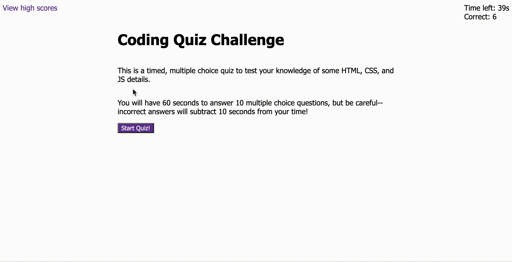

# 📝 code-quiz

This is a code quiz application that will test a developer's skills.

## Technology Used

* HTML
* CSS
* JavaScript

## Description

This application allows a user to start a timed, multiple choice quiz about HTML, CSS, and JS specifics. Each incorrect answer will subtract 10 seconds from the time. A list of scores is sorted and stored in localStorage.

## Setup

* Clone the repo
* Run index.html in your browser

## Deployment

This application is deployed using GitHub pages at this link: https://jmichaelbrown8.github.io/code-quiz/

